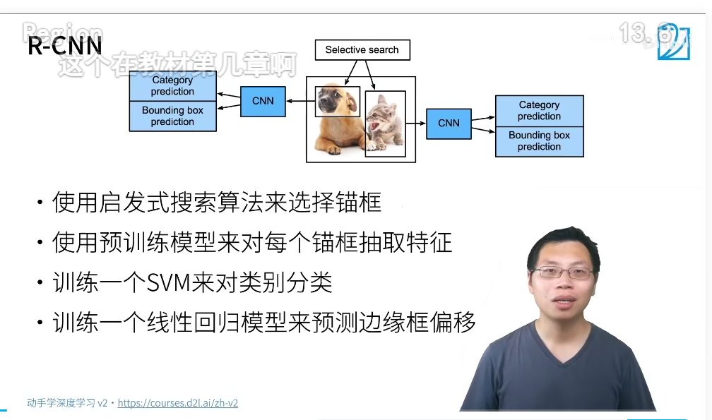
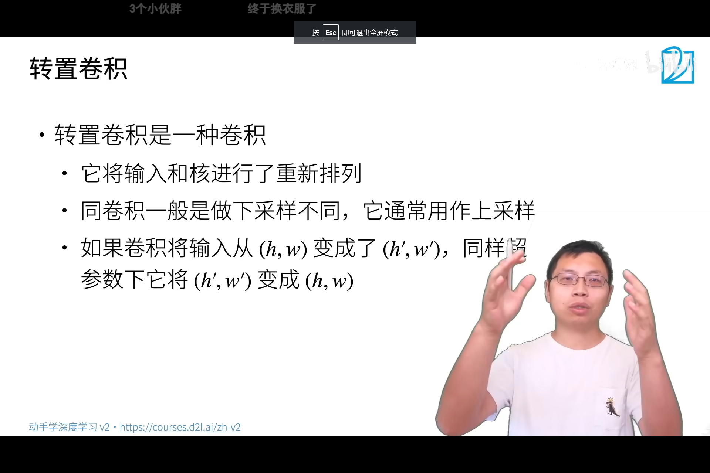

<!--
 * @Author       : JonnyZhang 71881972+jonnyzhang02@users.noreply.github.com
 * @LastEditTime : 2023-07-30 17:34
 * @FilePath     : \d2l-zh-pytorch\chapters\chapter_computer-vision\.md
 * 
 * coded by ZhangYang@BUPT, my email is zhangynag0207@bupt.edu.cn
-->
# 计算机视觉

<!-- TOC -->

- [计算机视觉](#%E8%AE%A1%E7%AE%97%E6%9C%BA%E8%A7%86%E8%A7%89)
    - [数据增广](#%E6%95%B0%E6%8D%AE%E5%A2%9E%E5%B9%BF)
        - [数据增广代码](#%E6%95%B0%E6%8D%AE%E5%A2%9E%E5%B9%BF%E4%BB%A3%E7%A0%81)
    - [微调](#%E5%BE%AE%E8%B0%83)
        - [微调代码](#%E5%BE%AE%E8%B0%83%E4%BB%A3%E7%A0%81)
- [目标检测](#%E7%9B%AE%E6%A0%87%E6%A3%80%E6%B5%8B)
    - [准备](#%E5%87%86%E5%A4%87)
        - [一些定义](#%E4%B8%80%E4%BA%9B%E5%AE%9A%E4%B9%89)
        - [边缘框实现](#%E8%BE%B9%E7%BC%98%E6%A1%86%E5%AE%9E%E7%8E%B0)
        - [数据集和数据集代码](#%E6%95%B0%E6%8D%AE%E9%9B%86%E5%92%8C%E6%95%B0%E6%8D%AE%E9%9B%86%E4%BB%A3%E7%A0%81)
    - [锚框 anchor box](#%E9%94%9A%E6%A1%86-anchor-box)
        - [锚框的定义](#%E9%94%9A%E6%A1%86%E7%9A%84%E5%AE%9A%E4%B9%89)
        - [IoU 交并比](#iou-%E4%BA%A4%E5%B9%B6%E6%AF%94)
        - [给锚框标号](#%E7%BB%99%E9%94%9A%E6%A1%86%E6%A0%87%E5%8F%B7)
        - [非极大值抑制 None-Maximum Suppression NMS](#%E9%9D%9E%E6%9E%81%E5%A4%A7%E5%80%BC%E6%8A%91%E5%88%B6-none-maximum-suppression-nms)
        - [锚框代码](#%E9%94%9A%E6%A1%86%E4%BB%A3%E7%A0%81)
    - [目标检测算法](#%E7%9B%AE%E6%A0%87%E6%A3%80%E6%B5%8B%E7%AE%97%E6%B3%95)
        - [R-CNN 区域卷积神经网络](#r-cnn-%E5%8C%BA%E5%9F%9F%E5%8D%B7%E7%A7%AF%E7%A5%9E%E7%BB%8F%E7%BD%91%E7%BB%9C)
        - [SSD 单发多框检测](#ssd-%E5%8D%95%E5%8F%91%E5%A4%9A%E6%A1%86%E6%A3%80%E6%B5%8B)
        - [YOLO](#yolo)
        - [SSD 代码](#ssd-%E4%BB%A3%E7%A0%81)
- [语义分割](#%E8%AF%AD%E4%B9%89%E5%88%86%E5%89%B2)
    - [语义分割数据集代码](#%E8%AF%AD%E4%B9%89%E5%88%86%E5%89%B2%E6%95%B0%E6%8D%AE%E9%9B%86%E4%BB%A3%E7%A0%81)
    - [转置卷积](#%E8%BD%AC%E7%BD%AE%E5%8D%B7%E7%A7%AF)
        - [卷积和转置卷积的输出大小](#%E5%8D%B7%E7%A7%AF%E5%92%8C%E8%BD%AC%E7%BD%AE%E5%8D%B7%E7%A7%AF%E7%9A%84%E8%BE%93%E5%87%BA%E5%A4%A7%E5%B0%8F)
            - [卷积](#%E5%8D%B7%E7%A7%AF)
            - [转置卷积](#%E8%BD%AC%E7%BD%AE%E5%8D%B7%E7%A7%AF)
        - [转置卷积代码](#%E8%BD%AC%E7%BD%AE%E5%8D%B7%E7%A7%AF%E4%BB%A3%E7%A0%81)
        - [转置卷积的计算](#%E8%BD%AC%E7%BD%AE%E5%8D%B7%E7%A7%AF%E7%9A%84%E8%AE%A1%E7%AE%97)
    - [FCN 全连接卷积神经网络](#fcn-%E5%85%A8%E8%BF%9E%E6%8E%A5%E5%8D%B7%E7%A7%AF%E7%A5%9E%E7%BB%8F%E7%BD%91%E7%BB%9C)
        - [FCN 代码](#fcn-%E4%BB%A3%E7%A0%81)
- [样式迁移](#%E6%A0%B7%E5%BC%8F%E8%BF%81%E7%A7%BB)
    - [基于CNN的样式迁移](#%E5%9F%BA%E4%BA%8Ecnn%E7%9A%84%E6%A0%B7%E5%BC%8F%E8%BF%81%E7%A7%BB)
    - [基于CNN的样式迁移代码](#%E5%9F%BA%E4%BA%8Ecnn%E7%9A%84%E6%A0%B7%E5%BC%8F%E8%BF%81%E7%A7%BB%E4%BB%A3%E7%A0%81)

<!-- /TOC -->

## 数据增广

更改色温、形状等，使得模型对于光线的变化更加鲁棒。

常见的数据增强：

**翻转**：左右、上下（取决于数据集，有的不能上下）

**切割**： 随机高宽比（如3/4）、随机大小（如60%等）、随机位置

**颜色**： 色彩抖动（随机改变亮度、对比度、饱和度和色调）

很多其他方法，在`imgaug`中都有实现。

### 数据增广代码

[notebook](./image-augmentation.ipynb)

## 微调

CV中最重要的部分。

又叫迁移学习。

核心思想是：在大的数据集上训练好的模型参数，可以作为一个很好的特征提取器，然后在小的数据集作为初始化参数，比随机初始化好很多。

训练要使用更强的正则化，防止过拟合。

重用分类器权重

固定一些层

越高层与标号越相关。

越底层特征更加通用。

这样可以固定一些底部的参数。

对于非大公司来讲，一般都是fine-tuning。

### 微调代码

[notebook](./fine-tuning.ipynb)

# 目标检测

## 准备

### 一些定义

图片里到底有哪些东西。

数量、类型、位置。

边缘框： bounding box

一般采用的是（x,y,w,h）的方式。

注意一般存储的格式：每一行表示一个物体

coco一般是日常见到的物体。物体数量大概和imagenet差不多。

### 边缘框实现

[notebook](./bounding-box.ipynb)

### 数据集和数据集代码

[coco](https://cocodataset.org/#home)

[ImageNet](http://www.image-net.org/)

[notebook](./object-detection-dataset.ipynb)

## 锚框 anchor box

### 锚框的定义

基于锚框的目标检测目前更为主流。

先画多个框，再去预测每个框里面有没有关注的物体。

如果有，预测这个锚框到真实边缘框的偏宜。

s是scale，r是ratio。

scale是大小，占整个图片的比例。

ratio是宽高比。

### IoU 交并比

交/并

### 给锚框标号

训练的时候，每一个锚框是一个训练样本。

每一个锚框，要么标注为背景，要么关联上一个**真实的边缘框**。

一个算法可能产生上万个锚框，但是只有很少的锚框和真实边缘框有关联。

该图片中有4个物体，生成了9个锚框。

一个图片过来会有好多训练样本。

### 非极大值抑制 None-Maximum Suppression NMS

选中**非背景类的最大预测值**

去掉和它IoU相似度大于阈值的锚框。

### 锚框代码

[notebook](./anchor.ipynb)

## 目标检测算法

目标检测里面小细节太多了，有很多trick，自己用一个notebook实现很难。

一般都会使用现成的库。使用C++和CUDA实现比较多。

### R-CNN 区域卷积神经网络

如何解决锚框大小不一样的问题呢？

给定n和m，总是输出一致。

fast-RCNN不对锚框抽特征，而是对整个图片抽特征。

搜索锚框后，找到每个锚框对应的CNN输出。

然后在RoI pooling

Faster-RCNN

Mask-RCNN

语义分割：对每个像素点进行分类。

###  SSD 单发多框检测

Single Shot MultiBox Detector

### YOLO

You Only Look Once

追求特别快

### SSD 代码

[notebook](./ssd.ipynb)

# 语义分割

Semantic Segmentation

属于像素级别的分类。

目标检测是是有监督的，语义分割可以做成无监督的。

vs实例分割

## 语义分割数据集代码

[语义分割和数据集](./semantic-segmentation-and-dataset.ipynb)

## 转置卷积

普通的卷积的高宽减半特性不利于语义分割的像素级分割。

所谓转置卷积，其实是卷积核和输入的角色互换了。

### 卷积和转置卷积的输出大小

#### 卷积

$$ output = 1 + \llcorner \frac{input + 2*p - K}{s} \lrcorner $$

$s=1,p=0$时

$ output = input - K + 1 $.

可以使

$ K = 3 , p = 1$ 

实现**高宽不变**（stride默认为1）.

#### 转置卷积

$$ output = (input - 1) * s + K - 2*p $$ 

$s=1,p=0$时：

$output = input + K - 1 $

可以使 

$ K = 2 * p + s $

实现高宽成$s$倍增加。

### 转置卷积代码

[转置卷积](./transposed-conv.ipynb)

### 转置卷积的计算

下采样：使高宽减少

上采样：使高宽增加

注意填充的不一样

总之就是先对输入填充：

$$
卷积核大小 - p - 1
$$

然后使用转置的卷积核进行正常卷积。

跟数学上的反卷积不一样。

## FCN 全连接卷积神经网络

Fully Connected Convolutional Network

深度学习用于语义分割的奠基性工作。

（所以现在不怎么用了）

K 等于有多少个类别。

### FCN 代码

[FCN](./fcn.ipynb)

# 样式迁移

## 基于CNN的样式迁移

三个网络是一样的，复制的

要训练的是Synthesised Image

## 基于CNN的样式迁移代码

[基于CNN的样式迁移](./neural-style.ipynb)

