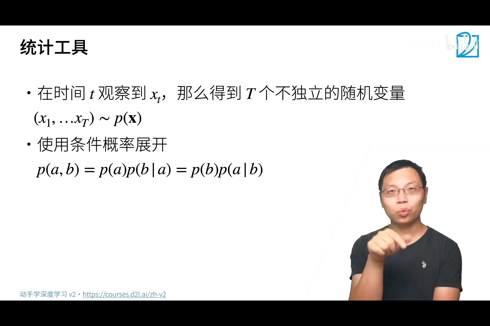
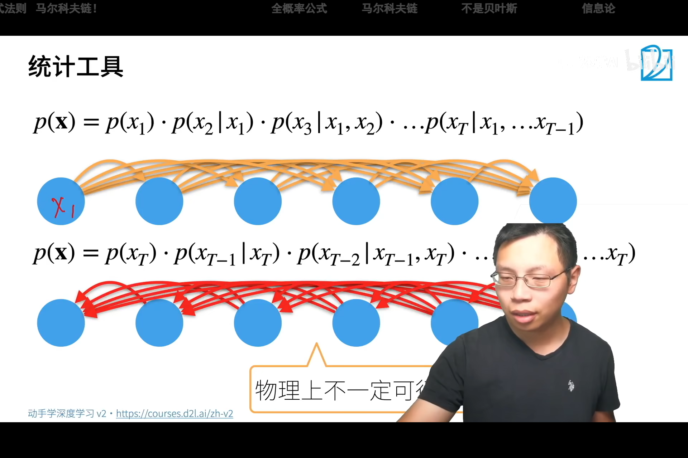
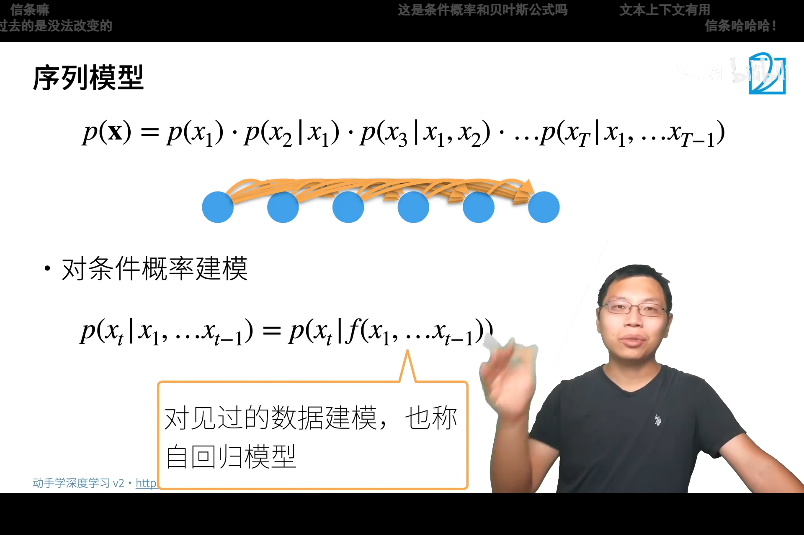
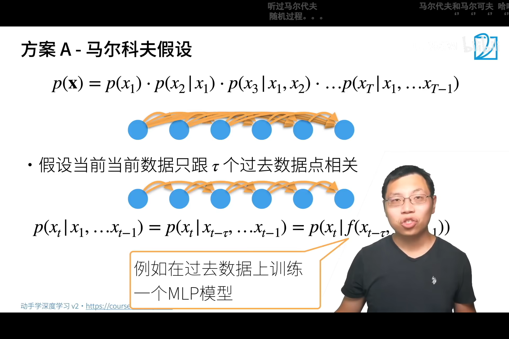
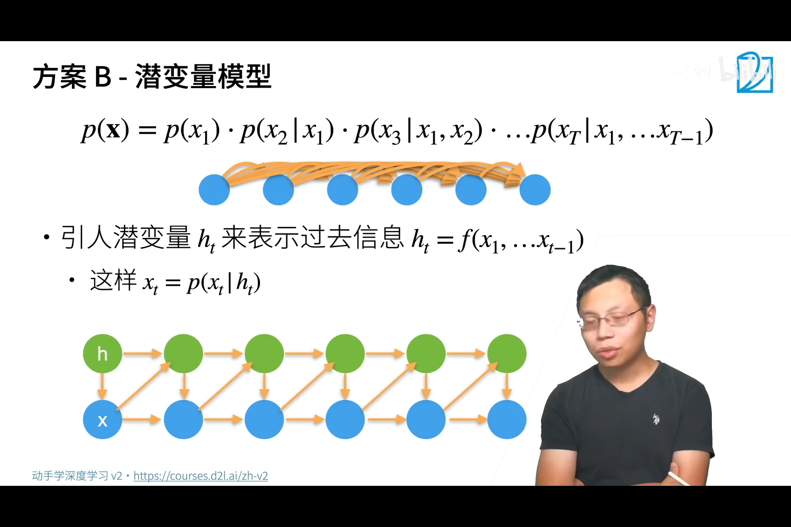
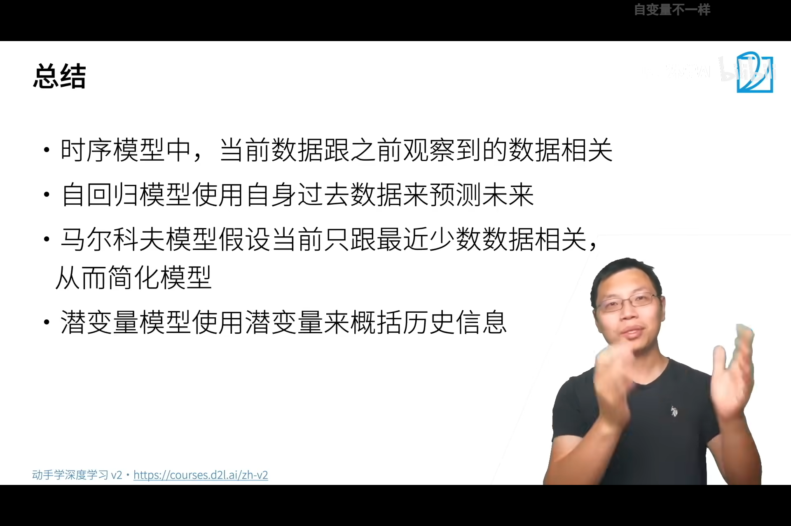

<!--
 * @Author       : JonnyZhang 71881972+jonnyzhang02@users.noreply.github.com
 * @LastEditTime : 2023-08-03 20:10
 * @FilePath     : \d2l-zh-pytorch\chapters\chapter_recurrent-neural-networks\.md
 * 
 * coded by ZhangYang@BUPT, my email is zhangynag0207@bupt.edu.cn
-->
# 循环神经网络 RNN

## 序列模型 

### Markov模型和潜变量模型

Sequence model

不独立的随机变量。

核心是给定一个序列，预测下一个元素。

自回归模型 autoregressive model

马尔可夫假设 Markov assumption

当前状态只与前面的**有限个**状态有关。

潜变量模型 latent variable model

新的潜变量h'由潜变量h和x共同决定。

x'由h'和x决定。

### Markov+MLP代码

[Markov模型用MLP实现预测代码](./sequence.ipynb)

## 文本预处理

[代码](./text-preprocessing.ipynb)

