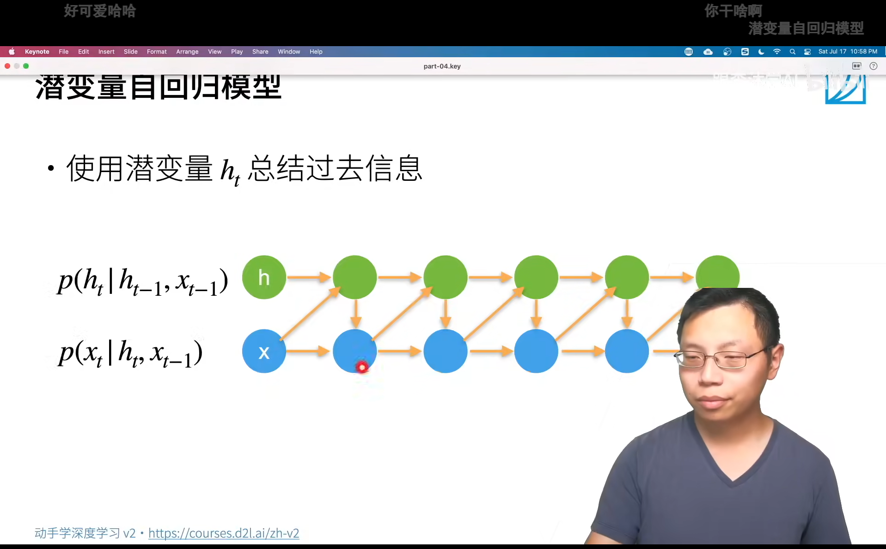

<!--
 * @Author       : JonnyZhang 71881972+jonnyzhang02@users.noreply.github.com
 * @LastEditTime : 2023-08-04 17:01
 * @FilePath     : \d2l-zh-pytorch\chapters\chapter_recurrent-neural-networks\.md
 * 
 * coded by ZhangYang@BUPT, my email is zhangynag0207@bupt.edu.cn
-->

# 循环神经网络 RNN

<!-- TOC -->

- [循环神经网络 RNN](#%E5%BE%AA%E7%8E%AF%E7%A5%9E%E7%BB%8F%E7%BD%91%E7%BB%9C-rnn)
    - [序列模型](#%E5%BA%8F%E5%88%97%E6%A8%A1%E5%9E%8B)
        - [Markov模型和潜变量模型](#markov%E6%A8%A1%E5%9E%8B%E5%92%8C%E6%BD%9C%E5%8F%98%E9%87%8F%E6%A8%A1%E5%9E%8B)
        - [Markov+MLP代码](#markovmlp%E4%BB%A3%E7%A0%81)
    - [文本预处理](#%E6%96%87%E6%9C%AC%E9%A2%84%E5%A4%84%E7%90%86)
    - [语言模型](#%E8%AF%AD%E8%A8%80%E6%A8%A1%E5%9E%8B)
        - [n-gram](#n-gram)
        - [n-gram代码](#n-gram%E4%BB%A3%E7%A0%81)
    - [循环神经网络](#%E5%BE%AA%E7%8E%AF%E7%A5%9E%E7%BB%8F%E7%BD%91%E7%BB%9C)
        - [潜变量和RNN](#%E6%BD%9C%E5%8F%98%E9%87%8F%E5%92%8Crnn)
        - [困惑度](#%E5%9B%B0%E6%83%91%E5%BA%A6)
        - [梯度剪裁](#%E6%A2%AF%E5%BA%A6%E5%89%AA%E8%A3%81)
        - [RNN代码](#rnn%E4%BB%A3%E7%A0%81)

<!-- /TOC -->

## 序列模型 

### Markov模型和潜变量模型

Sequence model

不独立的随机变量。

核心是给定一个序列，预测下一个元素。

自回归模型 autoregressive model

马尔可夫假设 Markov assumption

当前状态只与前面的**有限个**状态有关。

潜变量模型 latent variable model

新的潜变量h'由潜变量h和x共同决定。

x'由h'和x决定。

### Markov+MLP代码

[Markov模型用MLP实现预测代码](./sequence.ipynb)

## 文本预处理

[代码](./text-preprocessing.ipynb)

## 语言模型

简单使用次数统计

### n-gram

n元语法马尔可夫假设每个词只与前面的n-1个词有关。

要存的东西与n是指数关系。

### n-gram代码

[语言模型和数据集](./language-models-and-dataset.ipynb)

## 循环神经网络

### 潜变量和RNN

隐变量应该是一个固定长度的向量。

与MLP的区别就是用一个额外的$W_{hh} * h$来表示时序信息。

### 困惑度

`perplexity`

$x_t$ 是真实值，求一个平均交叉熵,预测为正确的概率 $p(x_t|x_{t-1},...,x_1)$。

### 梯度剪裁

防止梯度爆炸。

保证梯度长度永远不超过$\theta$。

### RNN代码

[从零开始实现](./rnn-scratch.ipynb)

[pytorch实现](./rnn-concise.ipynb)

